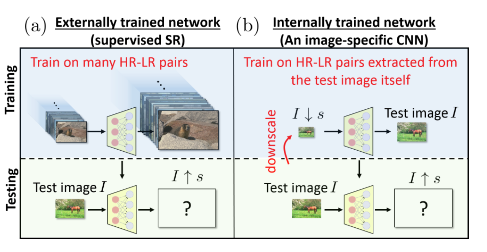
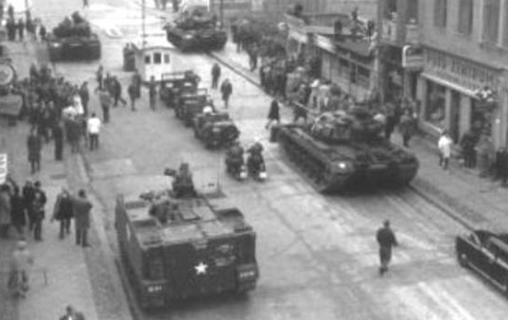
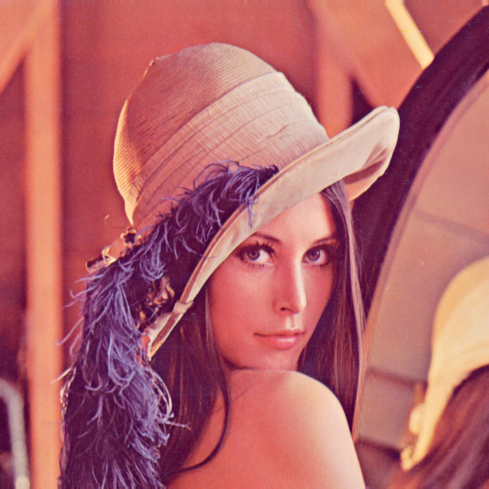

# ZSSR Keras
The Keras Implementation of the paper: [“Zero-Shot” Super-Resolution using Deep Internal Learning](http://www.weizmann.ac.il/math/irani/sites/math.irani/files/uploads/zssr_cameraready.pdf) - CVPR 2018

 

## Content
- [ZSSR Keras](#zssr-keras)
- [Getting Started](#getting-tarted)
- [Running](#running)
- [References](#references)
- [Citations](#citation)

## Getting Started

- Clone the repository

### Prerequisites

- Tensorflow 2.2.0+
- Python 3.6+
- Keras 2.3.0
- PIL
- numpy

```python
pip install -r requirements.txt
```

## Running

### Idea
```
"We exploit the internal recurrence of information inside a single image, and train a small image-specific CNN at test time, on
examples extracted solely from the input image itself. As such, it can adapt itself to different settings per image. This
allows to perform SR of real old photos, noisy images, biological data, and other images where the acquisition process is unknown or non-ideal."
```
### Training 

- Training
    ```
    python ZSSR.py 
    ```
## Usage
### Training
```
python train.py 
```
```
usage: ZSSR.py [-h] [--srFactor SRFACTOR] [--epochs EPOCHS]
               [--filepath FILEPATH] [--filters FILTERS] [--shuffle SHUFFLE]
               [--batch BATCH] [--layers LAYERS] [--sortOrder SORTORDER]
               [--scalingSteps SCALINGSTEPS] [--groundTruth GROUNDTRUTH]
               [--flip FLIP] [--noiseFlag NOISEFLAG] [--noiseSTD NOISESTD]
               [--save_aug SAVE_AUG] [--output_paths OUTPUT_PATHS]
```
```
optional arguments:
  -h, --help                    show this help message and exit
  --srFactor                    SRFACTOR
  --epochs                      EPOCHS
  --filepath                    FILEPATH
  --filters                     FILTERS
  --shuffle                     SHUFFLE
  --batch                       BATCH
  --layers                      LAYERS
  --sortOrder                   SORTORDER
  --scalingSteps                SCALINGSTEPS
  --groundTruth                 GROUNDTRUTH
  --flip                        FLIP
  --noiseFlag                   NOISEFLAG
  --noiseSTD                    NOISESTD
  --save_aug                    SAVE_AUG
  --output_paths                OUTPUT_PATHS
```

#### Result
 |  | 
 |  | 
|:---:|:---:|:---:|
| input | bicubic interpolation | zssr |

## License

This project is licensed under the MIT License - see the [LICENSE](https://github.com/tuvovan/Zero_DCE_TF/blob/master/LICENSE) file for details

## References
[1] “Zero-Shot” Super-Resolution using Deep Internal Learning - CVPR 2018 [link](http://www.weizmann.ac.il/math/irani/sites/math.irani/files/uploads/zssr_cameraready.pdf)
## Citation
```
@InProceedings{ZSSR,
  author = {Assaf Shocher, Nadav Cohen, Michal Irani},
  title = {"Zero-Shot" Super-Resolution using Deep Internal Learning},
  booktitle = {The IEEE Conference on Computer Vision and Pattern Recognition (CVPR)},
  month = {June},
  year = {2018}
}
```
## Acknowledgments

- This repo is the cleaner re-production of the Keras [version](https://github.com/missinglinkai/ZSSR) with some modification (mainly model parts)
- Final words:
    - Any ideas on updating or misunderstanding, please send me an email: <vovantu.hust@gmail.com>
    - If you find this repo helpful, kindly give me a star.

